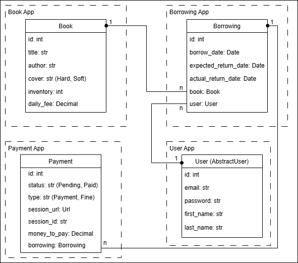

# 📚 Library API Service

This project is a **REST API service** for managing books, borrowings, users, and payments.
It is built using **Django Rest Framework (DRF)** with **PostgreSQL**, **Redis**, **Celery**, and **Docker**.

## 🛠 Installation

### `Python3` & `Docker` must be already installed

```shell
git clone https://github.com/mykytafabrykator/library-api-service.git
cd library-api-service
python3 -m venv venv
source venv/bin/activate  # (on macOS)
venv/Scripts/activate     # (on Windows)
pip install -r requirements.txt
```

Create a `.env` file in the root directory of the project and copy the contents from `.env.sample`, replacing the placeholder values with your own:

```shell
cp .env.sample .env
```

## 🚀 Running the Project

### Using Docker (Recommended)

```shell
docker-compose up --build
```

### Running without Docker
Create a PostgreSQL DB firstly. Then:
```shell
python manage.py migrate
python manage.py runserver
```

### Loading Test Data (Optional)

```shell
docker exec -it django_app sh
python manage.py loaddata load_data.json
```

## 👤 Test Credentials

### Admin User
* login: admin@admin.com
* password: pass

### Regular User
* login: hello_world@mail.com
* password: password

## 📄 API Documentation
After running the project, the API documentation will be available at:
* Swagger UI: http://localhost:8001/api/v1/doc/swagger/

## ✨ Features
- User authentication & authorization (JWT).
- Role-based access control for Admins and Users.
- Admin panel /admin/
- Borrowing system with automatic payment session creation.
- Book inventory management.
- Payment processing using Stripe.
- Telegram notifications for borrowings and overdue books.
- Background task scheduling with Celery.
- API documentation with Swagger.
- Database persistence using PostgreSQL.
- Docker & docker-compose support for easy deployment.

---

## ✍️ Tech Stack
- Python 3.12
- Django & Django REST Framework
- SQLite3 (for development)
- PostgreSQL (for production)
- Redis (Task queue backend for Celery)
- Celery & Celery Beat (Background task processing)
- Stripe API (Payment processing)
- Docker & Docker Compose
- JWT Authentication
- Documentation via drf-spectacular (Swagger)
- Telegram API (Notification system)

## 📁 Database Structure

